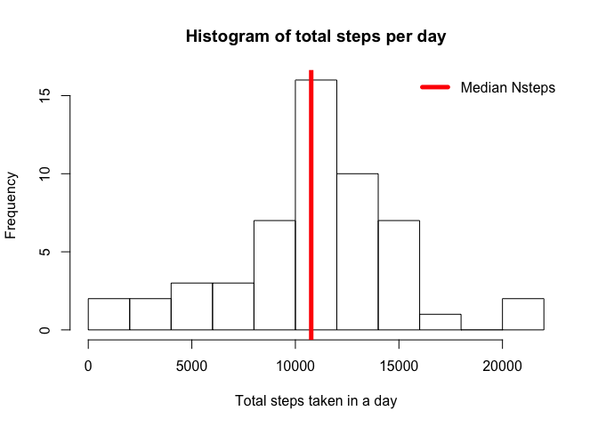
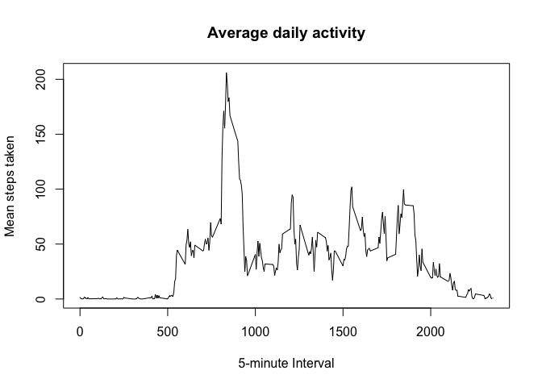
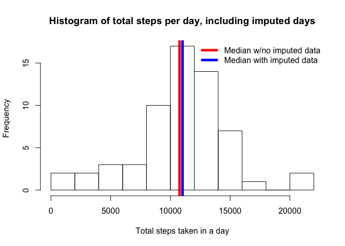
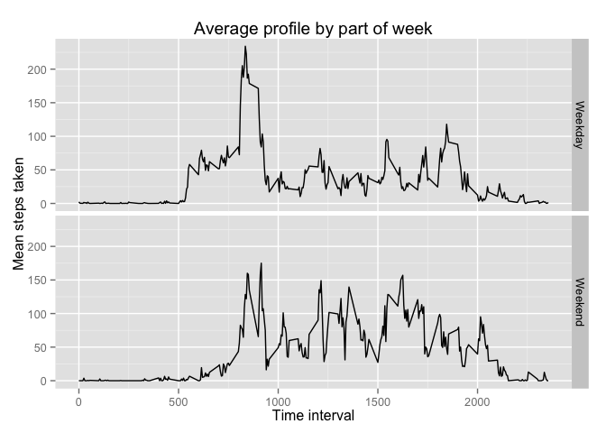

# Reproducible Research: Peer Assessment 1
Cathy White  


This document was created for the Coursera course Reproducible Research.  The intent is to practice literate statistical programming with the knitr package.  In this project, we are to load in and analyze activity monitoring data from one person taken at 5 minute intervals during October and November 2012.  

## Loading and preprocessing the data

First, we need to read in the data.  If you are running this code, you would need to change the variable `directory_with_data` to the directory on your machine which contains the file activity.zip.

Set the correct working directory.

```r
directory_with_data <- paste0("/Users/cathyc/Documents/School/Coursera/",
                              "ReproducibleResearch/Project1/RepData_",
                              "PeerAssessment1")
setwd(directory_with_data)
```

Create a temporary directory, unzip the file there, and read it in.

```r
tmpdir <- tempdir()
unzip("activity.zip", exdir=tmpdir)
activity <- read.csv(paste0(tmpdir, "/activity.csv"))
```

Pull in some useful libraries and make the dates nice.

```r
library(lubridate)
library(dplyr)
```

```
## 
## Attaching package: 'dplyr'
## 
## The following objects are masked from 'package:lubridate':
## 
##     intersect, setdiff, union
## 
## The following objects are masked from 'package:stats':
## 
##     filter, lag
## 
## The following objects are masked from 'package:base':
## 
##     intersect, setdiff, setequal, union
```

```r
activity$date <- ymd(activity$date)
```

## What is mean total number of steps taken per day?

Use aggregate to perform a sum of steps for each date and calculate the mean and median of the total number of steps per day.

```r
totals_by_date <- aggregate(steps~date, data=activity, sum, na.rm=TRUE)
mean_per_day <- mean(totals_by_date$steps)
median_per_day <- median(totals_by_date$steps)
```

Plot a histogram of the total number of steps per day.

```r
hist(totals_by_date$steps, breaks = 10, 
     main="Histogram of total steps per day", 
     xlab="Total steps taken in a day")
abline(v=median_per_day, lwd=5, col='Red')
legend("topright", lwd=5, legend = c("Median Nsteps"),
       col = c("Red"), box.lwd = 0)
```

 

The mean number of steps taken per day is 10766.19 and the median is 10765.

## What is the average daily activity pattern?

The average daily activity pattern is defined as the mean number of steps per 5 minute interval across all of the days.  We'll use aggregate again to compute this, ignoring missing values.

```r
mean_by_interval <- aggregate(steps ~ interval, data=activity, mean, na.rm=TRUE)
```

What does this average activity pattern look like?

```r
plot(mean_by_interval$interval, mean_by_interval$steps, type="l",
     xlab="5-minute Interval", ylab="Mean steps taken",
     main="Average daily activity")
```

 

The maximum average daily activity occurs at interval 835.

## Imputing missing values


Not all of the time intervals in this two-month period have a number of steps recorded.  Out of 17568 time intervals, 2304 intervals are missing data (13.11%).  We would like to fill in these values.  Since many people have different routines for different days of the week, we'll fill in missing values with the average value for that time interval for that day of the week.

We'll start by figuring out the average pattern by day of the week.  To do this we're going to do a couple steps:  

1) Make a column that holds the day of the week  
2) Group the data frame by day of the week and interval  
3) Calculate the mean steps for each day of week and interval and store in a new column  
4) Undo the grouping so that future operations aren't performed by this grouping  

The resulting data set will be saved to a new data frame.

```r
filled_activity <- activity %>%
    mutate(weekday=wday(date, label=TRUE)) %>%
    group_by(weekday, interval) %>%
    mutate(average_for_weekday=mean(steps, na.rm=TRUE)) %>%
    ungroup
```

Now we have the information that we need to fill in missing values.  Fill in the NA values in `steps` with the value in the column `average_for_weekday`, which contains the average number of steps for that time on all of the days that are the same day of the week.

```r
na_inds <- is.na(filled_activity$steps)
filled_activity$steps[na_inds] <- filled_activity$average_for_weekday[na_inds]
```

Now let's look at the histogram again and see if anything has changed.  First do the aggregates for the filled data set, then plot the histogram

```r
new_totals_by_date <- aggregate(steps~date, data=filled_activity, sum, na.rm=TRUE)
new_mean_per_day <- mean(new_totals_by_date$steps)
new_median_per_day <- median(new_totals_by_date$steps)

hist(new_totals_by_date$steps, breaks = 10, 
     main="Histogram of total steps per day, including imputed days", 
     xlab="Total steps taken in a day")
abline(v=median_per_day, lwd=5, col='Red')
abline(v=new_median_per_day, lwd=5, col='Blue')
legend("topright", lwd=5, col = c("Red", "Blue"), box.lwd = 0,
       legend = c("Median w/no imputed data", 
                  "Median with imputed data"))
```

 


The original mean total number of steps per day was 10766.19.  With the imputed data, the mean is 10821.21, an increase of 0.51%.  The original median is 10765 and the median with the imputed data is 11015, an increase of 2.32%.

## Are there differences in activity patterns between weekdays and weekends?

We first need to classify days as either weekend or weekday.  Add a new column, `part_of_week`, that says "weekend" if the `weekday` column is "Sat" or "Sun" and "weekday" otherwise.  To do this, it's easier to just write a little function than to stuff everything into the call to `mutate`.

```r
week_part <- function(days){
    parts <- rep("Weekday", length(days))
    parts[days %in% c("Sat", "Sun")] <- "Weekend"
    parts
}

activity <- activity %>%
    mutate(weekday=wday(date, label=TRUE)) %>%
    mutate(part_of_week = week_part(weekday))
```

Now compute the average profile for weekdays and weekends.  Use aggregate to make a new data frame with the two average profiles.  Plot with `ggplot2`.

```r
by_part_of_week <- aggregate(steps ~ interval + part_of_week,
                             data=activity, mean, na.rm=TRUE)
library(ggplot2)
qplot(interval, steps, data=by_part_of_week, facets = part_of_week~., 
      geom="line", xlab="Time interval", ylab="Mean steps taken",
      main="Average profile by part of week")
```

 

